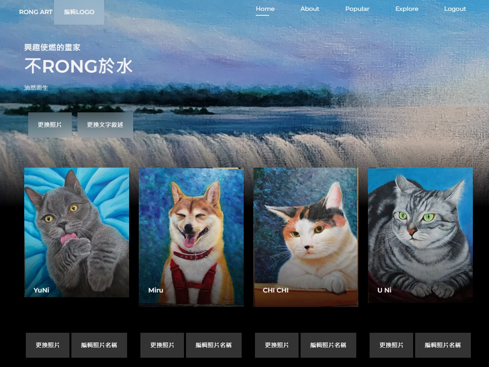
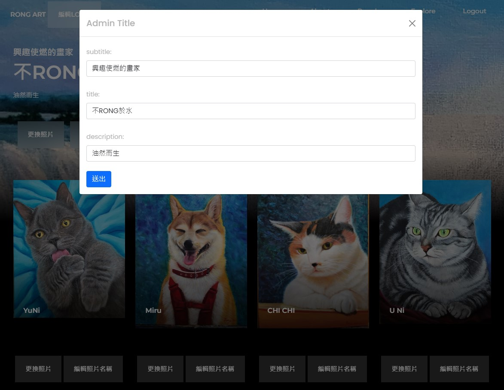

# 形象網站 & 後端管理 & 獨立開發

**設計者:** 吳威儒  
**前端設計參考:** [Bedimcode](https://github.com/Bedimcode)  
**後端管理設計:** 獨立開發  

## 設計動機

我的母親是一位熱愛創作的藝術家，創作了上百幅油畫作品。為了在網路上展示及販賣她的作品，我運用課程所學，開發了一個連她都能輕鬆操作的圖片上傳後端介面，讓她能夠輕鬆管理屬於自己的藝術畫廊。

## 設計理念

本設計旨在滿足使用者的需求，讓不具備程式設計知識的使用者也能輕鬆替換照片及編輯文字，從而輕鬆完成自己專屬的形象網站。

---

## 系統畫面截圖

### 首頁

### 管理頁面

### 登入畫面

### 檔案上傳畫面

### 文字上傳畫面

### Link 管理畫面

### 資料庫畫面

---

## Features

- **簡易圖片上傳:** 使用者可以輕鬆上傳及管理圖片。
- **自定義編輯:** 不需編寫程式碼即可替換照片及編輯文字內容。
- **自由定義形象網站管理:** 專為各式作品展示而設計的管理介面。

``
## 實際上機網址

[https://wda.mackliu.com/s1130102/web_desgin](https://wda.mackliu.com/s1130102/web_desgin)

## 聯絡信息

如有任何問題或建議，請聯絡 [d128579744@gmail.com](mailto:d128579744@gmail.com)。

---

感謝您的使用與支持！
